# Import Graph

This file labels scripts by static ES module imports. Bitburner also launches many files by name through `ns.run`, `ns.exec`, `spawn`, `scp`, or helper wrappers, so "not imported" means standalone from an import-graph perspective, not necessarily unused or safe to delete.

## Graph

```mermaid
graph TD
  analyze_hack["analyze-hack.js"] --> helpers["helpers.js"]
  ascend["ascend.js"] --> helpers
  autopilot["autopilot.js"] --> helpers
  bladeburner["bladeburner.js"] --> helpers
  casino["casino.js"] --> helpers
  crime["crime.js"] --> helpers
  crime --> work_for_factions["work-for-factions.js"]
  daemon["daemon.js"] --> helpers
  dump_ns_namespace["dump-ns-namespace.js"] --> helpers
  faction_manager["faction-manager.js"] --> helpers
  farm_intelligence["farm-intelligence.js"] --> helpers
  gangs["gangs.js"] --> helpers
  go["go.js"] --> helpers
  hacknet_upgrade_manager["hacknet-upgrade-manager.js"] --> helpers
  host_manager["host-manager.js"] --> helpers
  kill_all_scripts["kill-all-scripts.js"] --> helpers
  reserve["reserve.js"] --> helpers
  run_command["run-command.js"] --> helpers
  scan["scan.js"] --> helpers
  sleeve["sleeve.js"] --> helpers
  spend_hacknet_hashes["spend-hacknet-hashes.js"] --> helpers
  stanek["stanek.js"] --> helpers
  stanek_create["stanek.js.create.js"] --> helpers
  stats["stats.js"] --> helpers
  stockmaster["stockmaster.js"] --> helpers
  task_backdoor_all_servers["Tasks/backdoor-all-servers.js"] --> helpers
  task_contractor["Tasks/contractor.js"] --> helpers
  task_contractor_solver["Tasks/contractor.js.solver.js"] --> helpers
  task_ram_manager["Tasks/ram-manager.js"] --> helpers
  work_for_factions --> helpers
```

## Imported Modules

| File | Imported by |
| --- | --- |
| `bitburnerFiles/helpers.js` | `analyze-hack.js`, `ascend.js`, `autopilot.js`, `bladeburner.js`, `casino.js`, `crime.js`, `daemon.js`, `dump-ns-namespace.js`, `faction-manager.js`, `farm-intelligence.js`, `gangs.js`, `go.js`, `hacknet-upgrade-manager.js`, `host-manager.js`, `kill-all-scripts.js`, `reserve.js`, `run-command.js`, `scan.js`, `sleeve.js`, `spend-hacknet-hashes.js`, `stanek.js`, `stanek.js.create.js`, `stats.js`, `stockmaster.js`, `Tasks/backdoor-all-servers.js`, `Tasks/contractor.js`, `Tasks/contractor.js.solver.js`, `Tasks/ram-manager.js`, `work-for-factions.js` |
| `bitburnerFiles/work-for-factions.js` | `crime.js` |

## Standalone / Not Imported

These files have no incoming static imports from other files in this repository.

- `bitburnerFiles/analyze-hack.js`
- `bitburnerFiles/ascend.js`
- `bitburnerFiles/autopilot.js`
- `bitburnerFiles/bladeburner.js`
- `bitburnerFiles/casino.js`
- `bitburnerFiles/cleanup.js`
- `bitburnerFiles/crime.js`
- `bitburnerFiles/customStats.js`
- `bitburnerFiles/daemon.js`
- `bitburnerFiles/deployer.js`
- `bitburnerFiles/dev-console.js`
- `bitburnerFiles/dump-ns-namespace.js`
- `bitburnerFiles/early-hack-template.js`
- `bitburnerFiles/faction-manager.js`
- `bitburnerFiles/farm-intelligence.js`
- `bitburnerFiles/gangs.js`
- `bitburnerFiles/go.js`
- `bitburnerFiles/grep.js`
- `bitburnerFiles/hacknet-upgrade-manager.js`
- `bitburnerFiles/host-manager.js`
- `bitburnerFiles/kill-all-scripts.js`
- `bitburnerFiles/optimize-stanek.js`
- `bitburnerFiles/pathfinder.js`
- `bitburnerFiles/purchase-servers.js`
- `bitburnerFiles/Remote/grow-target.js`
- `bitburnerFiles/Remote/hack-target.js`
- `bitburnerFiles/Remote/manualhack-target.js`
- `bitburnerFiles/Remote/share.js`
- `bitburnerFiles/Remote/weak-target.js`
- `bitburnerFiles/reserve.js`
- `bitburnerFiles/run-command.js`
- `bitburnerFiles/scan.js`
- `bitburnerFiles/shared/grow.js`
- `bitburnerFiles/shared/hack.js`
- `bitburnerFiles/shared/weaken.js`
- `bitburnerFiles/sleeve.js`
- `bitburnerFiles/spend-hacknet-hashes.js`
- `bitburnerFiles/stanek.js`
- `bitburnerFiles/stanek.js.create.js`
- `bitburnerFiles/startup.js`
- `bitburnerFiles/stats.js`
- `bitburnerFiles/stockmaster.js`
- `bitburnerFiles/sync-scripts.js`
- `bitburnerFiles/Tasks/backdoor-all-servers.js`
- `bitburnerFiles/Tasks/backdoor-all-servers.js.backdoor-one.js`
- `bitburnerFiles/Tasks/contractor.js`
- `bitburnerFiles/Tasks/contractor.js.solver.js`
- `bitburnerFiles/Tasks/crack-host.js`
- `bitburnerFiles/Tasks/program-manager.js`
- `bitburnerFiles/Tasks/ram-manager.js`
- `bitburnerFiles/Tasks/run-with-delay.js`
- `bitburnerFiles/Tasks/tor-manager.js`
- `bitburnerFiles/Tasks/write-file.js`
